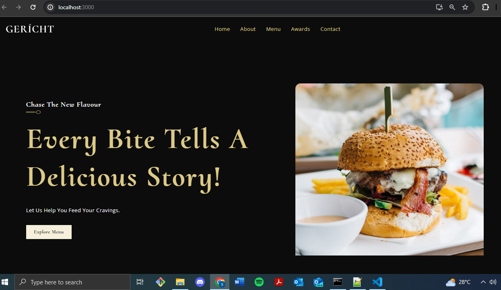
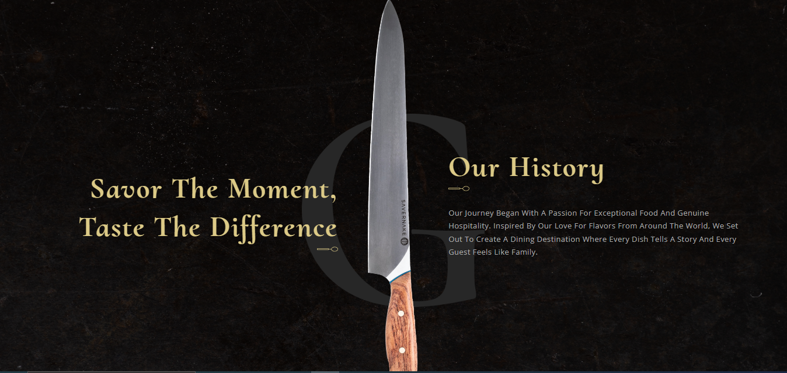
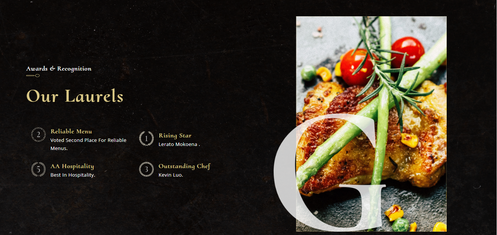
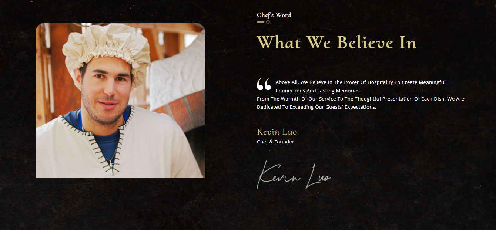
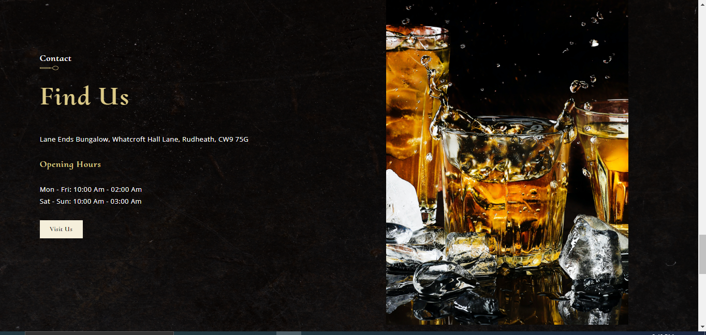
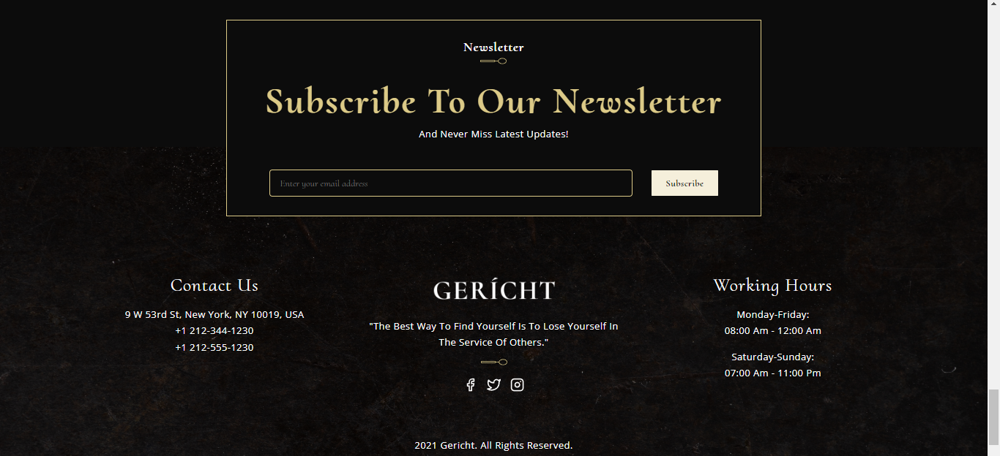
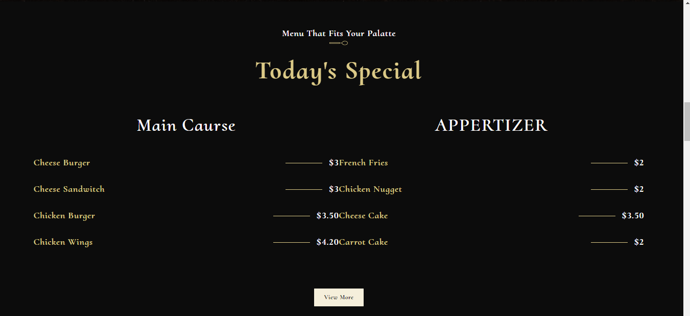

# Gericht-Resturant
Welcome to our responsive  Menu Items Website built with React.js!

## Description
This website provides a user-friendly interface to explore our delicious menu items. Whether you're craving appetizers, main courses, or desserts, our menu has something to satisfy every palate.

## Features
 Responsive Design: Our website is optimized for both desktop and mobile devices, ensuring a seamless browsing experience across all platforms.

## Technologies used
- React.js: Frontend library for building user interfaces.
- JavaScript: Programming language used to build interactive features.
- CSS: Styling language for designing the layout and appearance of the website.
- HTML: Markup language for structuring the content of web pages.
